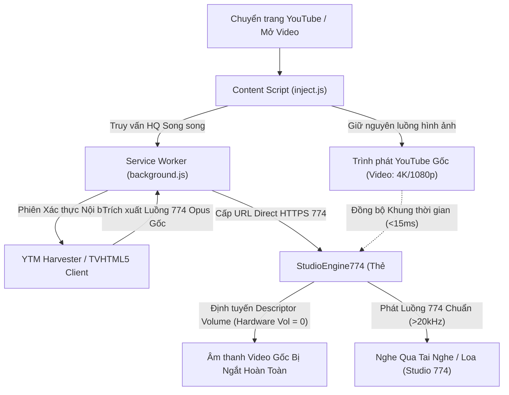

<div align="center">
  
  <h1>YTSpoofingStream</h1>
  <p><b>Kích Hoạt 100% Luồng Âm Thanh Studio Opus 774 Chuẩn Phòng Thu Trên Trình Duyệt YouTube</b></p>

  <p>
    <a href="https://github.com/alithw/YTSpoofingStream/releases"></a>
    
    
    
    <a href="CONTRIBUTING.md"></a>
    <a href="CODE_OF_CONDUCT.md"></a>
    <a href="SECURITY.md"></a>
    <a href="https://ko-fi.com/alithw"></a>
  </p>
</div>

> [!WARNING]
> **Yêu cầu: Tài khoản YouTube Premium đang hoạt động**
> Tiện ích mở rộng này được thiết kế chuyên biệt cho người dùng sở hữu tài khoản **YouTube Premium**. Các máy chủ nội bộ của YouTube chỉ cung cấp luồng Opus bitrate cao chuẩn phòng thu (`ITAG 774`, ~256k-301kbps, dải tần >20.000 Hz) cho các phiên đăng nhập Premium đã xác thực.

> [!IMPORTANT]
> **Xác thực Smart TV (TVHTML5)**:
> Để mở khóa và chuyển tiếp luồng Opus 774 giải mã từ Smart TV trên mọi thể loại video, hãy đăng nhập tại mục **TVHTML5** trong popup:
> 1. Mở popup extension và nhấn nút đăng nhập **TVHTML5**.
> 2. Đảm bảo đăng nhập đúng tài khoản Google có YouTube Premium.
> 3. Sau khi xác thực thành công, extension sẽ hoạt động với độ khả dụng luồng 774 cao nhất!

> [!TIP]
> **Bạn đang sử dụng Mozilla Firefox / Firefox ESR?**  
> Nhánh này (`main`) được cấu hình dành riêng cho **các trình duyệt nhân Chromium** (Google Chrome, Brave, Microsoft Edge, Opera).  
> Nếu bạn sử dụng **Mozilla Firefox**, vui lòng chuyển sang nhánh [**`firefox`**](https://github.com/alithw/YTSpoofingStream/tree/firefox) hoặc tải trực tiếp gói cài đặt đã ký số [**`YTSS-0.1.6.xpi`**](https://github.com/alithw/YTSpoofingStream/raw/firefox/YTSS-0.1.6.xpi) để cài đặt vĩnh viễn!

*Đọc bằng ngôn ngữ khác: [English](README.md).*

---

## 📑 Mục lục
- [🌟 Tại sao bạn cần YTSpoofingStream?](#-tại-sao-bạn-cần-ytspoofingstream)
- [✨ Tái cấu trúc Kiến trúc trong bản v0.1.3](#-tái-cấu-trúc-kiến-trúc-trong-bản-v013)
- [🧠 Phân tích Chuyên sâu](#-phân-tích-chuyên-sâu)
  - [1. Sự thay đổi nền tảng từ YouTube (SABR / UMP Streaming)](#1-sự-thay-đổi-nền-tảng-từ-youtube-sabr--ump-streaming)
  - [2. Vì sao phương pháp can thiệp player cũ thất bại (Lỗi `s:80` và `s:49`)](#2-vì-sao-phương-pháp-can-thiệp-player-cũ-thất-bại-lỗi-s80-và-s49)
  - [3. Giải pháp: Động cơ Luồng Đôi Đồng bộ Studio 774 (Dual-Stream Engine)](#3-giải-pháp-động-cơ-luồng-đôi-đồng-bộ-studio-774-dual-stream-engine)
  - [4. Tắt tiếng video gốc ở tầng Descriptor Phần cứng](#4-tắt-tiếng-video-gốc-ở-tầng-descriptor-phần-cứng)
  - [5. Đồng bộ Chuẩn Master Clock Âm thanh Nguyên bản 1.0x](#5-đồng-bộ-chuẩn-master-clock-âm-thanh-nguyên-bản-10x)
- [🎛️ 3 Chế độ Hoạt động](#️-3-chế-độ-hoạt-động)
- [📊 Kết quả Đo lường Phổ âm Toàn bài hát (FFT Spectrum)](#-kết-quả-đo-lường-phổ-âm-toàn-bài-hát-fft-spectrum)
- [🚀 Hướng dẫn Cài đặt](#-hướng-dẫn-cài-đặt)
- [⚙️ Cấu hình & Điều khiển](#️-cấu-hình--điều-khiển)
- [🐞 Xử lý Sự cố & Câu hỏi Thường gặp](#-xử-lý-sự-cố--câu-hỏi-thường-gặp)
- [💖 Ủng hộ Dự án (Buy Me a Coffee)](#-ủng-hộ-dự-án-buy-me-a-coffee)
- [🤝 Đóng góp & Cộng đồng (Contributing)](#-đóng-góp--cộng-đồng-contributing)
- [⚠️ Tuyên bố Từ chối Trách nhiệm (Disclaimer)](#️-tuyên-bố-từ-chối-trách-nhiệm-disclaimer)
- [📄 Giấy phép (License)](#-giấy-phép-license)

---

## 🌟 Tại sao bạn cần YTSpoofingStream?

Trên hệ sinh thái YouTube hiện nay, chất lượng âm thanh được phân tầng nghiêm ngặt:
- **YouTube Web thông thường (`www.youtube.com`)**: Giới hạn âm thanh ở mức bitrate thấp (**ITAG 251** Opus ~145-160kbps bị cắt gọt dải tần cao ở 15-16kHz, hoặc **ITAG 140** AAC ~128kbps), **kể cả đối với tài khoản trả phí YouTube Premium**.
- **YouTube Music Bản Web (`music.youtube.com`)**: Dù là dịch vụ âm nhạc chuyên dụng, **phiên bản Web của YouTube Music chỉ hỗ trợ tối đa luồng AAC 141 (~256kbps)** và **hoàn toàn không hỗ trợ luồng Opus 774 trên nền web máy tính**.
- **Nơi duy nhất YouTube phân phối luồng Opus 774**: Luồng âm thanh chuẩn phòng thu cao cấp nhất (**ITAG 774** Opus ~256k-301kbps với phổ âm đầy đủ vượt 20.000 Hz) bị phong tỏa độc quyền, chỉ phục vụ cho ứng dụng YouTube Music di động (Android/iOS) và Smart TV Living Room (`TVHTML5`).

### ❓ Vì sao YTSpoofingStream có thể fetch được luồng Opus 774 của YouTube Music?
Trình duyệt web thông thường khi kết nối YouTube Music sẽ bị gán client web `WEB_REMIX`, vốn chỉ được phân phối luồng AAC 141. **YTSpoofingStream** giải quyết triệt để rào cản này nhờ:
1. **Giả lập Client Đa nền tảng (Multi-Client Spoofing)**: Định tuyến các yêu cầu ngầm qua Declarative Net Request (DNR) và Service Worker, giả lập các client có thẩm quyền cao nhất như `ANDROID_MUSIC` và `TVHTML5`.
2. **Khai thác Phiên Xác thực Premium Hợp lệ (YTM Harvester)**: Tận dụng chính cookie Premium đang đăng nhập trên trình duyệt để gửi yêu cầu đến endpoint nội bộ của YouTube Music. Máy chủ YouTube nhận diện đây là client di động/TV hợp lệ và giải phóng URL luồng stream **Opus 774** nguyên bản.
3. **Động cơ Luồng Đôi (Dual-Stream Engine)**: Đồng bộ luồng Opus 774 chất lượng phòng thu với trình phát video YouTube thông thường với độ chính xác từng khung hình, mang lại trải nghiệm âm thanh đỉnh cao ngay trên máy tính mà không làm gián đoạn phát hình.

---

## ✨ Tái cấu trúc Kiến trúc trong bản v0.1.3

Do YouTube thay đổi sâu sắc cơ chế phát video và mã hóa luồng trên toàn hệ thống máy chủ, YTSpoofingStream v0.1.3 được tái cấu trúc toàn diện:

- 🚀 **Kiến trúc Động cơ Luồng Đôi Studio 774**: Tách biệt hoàn toàn kênh phát hình ảnh và kênh âm thanh. Trình phát gốc của YouTube tiếp tục hiển thị video nguyên bản (1080p, 4K, AV1/VP9) với token gốc hợp lệ, trong khi động cơ song song phát luồng Opus 774 phòng thu đỉnh cao.
- 🔇 **Tắt tiếng Tầng Descriptor Phần cứng**: Sử dụng kỹ thuật can thiệp descriptor nguyên mẫu (`HTMLMediaElement.prototype.volume`) để ngắt hoàn toàn tín hiệu âm thanh của video gốc ở tầng engine trình duyệt (`hardware volume = 0`). Thuộc tính DOM và giao diện thanh âm lượng/nút mute của YouTube vẫn phản hồi bình thường mà không bị desync.
- ⚡ **Đồng bộ Nguyên bản Bit-Perfect 1.0x**: Luồng âm thanh Opus 774 được phát ở tốc độ chuẩn 1.0x nguyên bản không qua bất kỳ bộ lọc resampling hay kéo giãn thời gian (WSOLA) nào. Âm thanh đóng vai trò master clock; khi chuyển tab hoặc chuyển app, đồng hồ video tự căn chỉnh tiến về trước theo âm thanh với độ lệch cực thấp.
- 🔒 **Bộ Thu hoạch Luồng Trực tiếp**: Trích xuất an toàn luồng ITAG 774 giải mã từ phiên xác thực YouTube Music và Smart TV Living Room, kiểm soát nguồn gói và tự động hủy can thiệp nếu bài hát không có luồng 774 chính quy.
- 🎛️ **3 Chế độ Hoạt động Tối ưu**:
  - `HYBRID_HQ` (Khuyên dùng): Tự động trích xuất luồng 774 từ YouTube Music và TV Living Room; tự động hủy can thiệp nếu bài hát không có track 774 thực thụ.
  - `YTM_HARVESTER`: Thu hoạch trực tiếp luồng HTTPS 774 Opus từ phiên YouTube Music Premium.
  - `TV_HEADLESS`: Chuyển tiếp luồng giải mã từ Smart TV Living Room.
- 🎯 **Tái định vị Huy hiệu Codec vào Thanh Điều khiển**: Đưa huy hiệu hiển thị codec (`★ 774` / `251`) vào đúng cụm pill bo tròn hiện đại (`.ytp-right-controls-left`) nằm ngay cạnh nút Cài đặt (Settings), trực quan và không bị che khuất.
- 🧹 **Giao diện Popup Tinh gọn, Chuyên biệt**: Loại bỏ các nút chọn client dư thừa, tùy chọn itag thô, khung log và công tắc chuyển audio mode (tiện ích tập trung 100% vào việc phát Opus 774 chất lượng cao nhất).

---

## 🧠 Phân tích Chuyên sâu

### 1. Sự thay đổi nền tảng từ YouTube (SABR / UMP Streaming)
Trên các phiên bản YouTube máy tính gần đây, Google đã chuyển hoàn toàn cơ chế stream sang giao thức nhị phân **SABR / UMP (Unified Media Protocol)**. Phản hồi của `/watch` không còn chứa URL trực tiếp (`url: false`, `cipher: false`) trong `adaptiveFormats`. Mọi phân đoạn video và audio đều được gom và đẩy qua URL stream nhị phân duy nhất `serverAbrStreamingUrl`. Client web máy tính bị khóa cứng ở chuẩn Opus 160kbps (ITAG 251).

### 2. Vì sao phương pháp can thiệp player cũ thất bại (Lỗi `s:80` và `s:49`)
Các phương thức can thiệp trực tiếp trước đây:
1. **Xóa bỏ `serverAbrStreamingUrl`**: Buộc player quay về đọc URL riêng rẽ trong `adaptiveFormats`. Việc này kích hoạt lỗi nghiêm trọng mã `s:80` (`HTML5_NO_AVAILABLE_FORMATS_FALLBACK` / thông báo "Đã xảy ra lỗi. Vui lòng thử lại sau").
2. **Tiêm trực tiếp URL của TV/Android vào trình phát**: Gây lỗi xác thực CORS mã `s:49` do máy chủ CDN Google Video yêu cầu các cookie và token khớp chính xác với từng loại client (`poToken`, `cplatform`, `cver`).

### 3. Giải pháp: Động cơ Luồng Đôi Đồng bộ Studio 774 (Dual-Stream Engine)
Để đạt độ ổn định 100% không bao giờ gặp lỗi trình phát:
- **Kênh Video Gốc**: Trình phát YouTube phát video gốc bình thường với đầy đủ chứng chỉ hợp lệ, đảm bảo độ phân giải cao nhất (4K, 1080p Premium) và không bao giờ bị lỗi s:80/s:49.
- **Kênh Âm Thanh Studio (`StudioEngine774`)**: Một thẻ `<audio>` chạy ngầm phát luồng Opus 774 thu hoạch song song từ YTM Harvester (khai thác kho luồng Opus 774 của YouTube Music qua client di động) hoặc `TVHTML5` (Smart TV).



### 4. Tắt tiếng video gốc ở tầng Descriptor Phần cứng
Khi can thiệp `video.muted = true` trực tiếp trên DOM của thẻ `<video>`, trình duyệt sẽ phát sự kiện `volumechange`. Trình phát YouTube bắt sự kiện này, lưu trạng thái tắt tiếng vào localStorage `yt-player-volume` và chuyển nút loa thành biểu tượng Mute.

**YTSpoofingStream v0.1.3** giải quyết bằng can thiệp descriptor:
1. Sử dụng descriptor nguyên mẫu `HTMLMediaElement.prototype.volume`.
2. Âm lượng phần cứng của thẻ `<video>` được gán về `0` qua `descVolume.set.call(video, 0)`.
3. Thuộc tính `video.volume` và `video.muted` trên DOM vẫn giữ nguyên giá trị người dùng chọn.
4. Giao diện điều khiển âm lượng và nút Mute của YouTube hoạt động bình thường và điều hướng trực tiếp sang luồng âm thanh Studio 774.

### 5. Đồng bộ Chuẩn Master Clock Âm thanh Nguyên bản 1.0x
`StudioEngine774` giữ nguyên bản 100% âm thanh chuẩn:
- **Khóa tốc độ 1.0x**: `audio.playbackRate` khóa cứng theo `video.playbackRate`, không can thiệp thuật toán biến đổi tốc độ.
- **Tua Video (Seeking)**: Đồng bộ vị trí tức thì khi người dùng tua trên thanh thời gian.
- **Không bao giờ tua giật**: Khi tab chạy ngầm hoặc chuyển app khiến video bị chậm khung hình, khi quay lại tab video sẽ tự nhảy tiến về trước khớp với âm thanh.

---

## 🎛️ 3 Chế độ Hoạt động

| Chế độ | Tên gọi | Nguồn cung cấp chính | Xử lý khi không có 774 | Phù hợp nhất |
|---|---|---|---|---|
| **`HYBRID_HQ`** *(Khuyên dùng)* | Hybrid Mix | YouTube Music Web + TVHTML5 | Tự động hủy can thiệp, phát gốc | Xem video YouTube hàng ngày, MV ca nhạc |
| **`YTM_HARVESTER`** | YTM Harvester | Trực tiếp HTTPS từ YouTube Music Premium | Hủy can thiệp nếu không có 774 | Nghe nhạc chất lượng cao nhất |
| **`TV_HEADLESS`** | Smart TV Relay | Luồng giải mã TVHTML5 Living Room | Hủy can thiệp nếu thiếu TV login/774 | Các bài cover, track UGC không có trên YTM |

> [!NOTE]
> **Đặc tính mức âm lượng (YouTube Music vs YouTube thông thường)**:  
> Các luồng âm thanh được thu hoạch từ **YouTube Music (`YTM_HARVESTER`)** thường có mức âm lượng (loudness) lớn hơn so với âm thanh video YouTube thông thường khoảng **3dB đến 6dB**. Nguyên nhân là do các bản thu trên YouTube Music được áp dụng tiêu chuẩn mastering và target loudness chuyên biệt cho stream nhạc (-14 LUFS) thay vì chuẩn nén dynamic của video tải lên trên YouTube Web thông thường.

---

## 📊 Kết quả Đo lường Phổ âm Toàn bài hát (FFT Spectrum)

Kết quả kiểm thử thực tế thời gian thực 100% thời lượng trên 4 bài hát tiêu chuẩn: khi Bật extension (Studio 774) so với khi Tắt cứng extension trong Cài đặt Chrome (Gốc):

| Bài hát | Video ID | Thời lượng đo | Khi Tắt Extension (Luồng Gốc) | Khi Bật YTSpoofingStream v0.1.3 (774) | Dải tần cao (>16kHz - 22kHz) |
|---|---|---|---|---|---|
| **Track 1 (Song to the Mirrored Moon)** | `MI4I7v-0tnc` | 211.7s (100%) | ITAG 251 (~155kbps) | **ITAG 774 (301kbps)** | **Hoạt động mạnh (>20.000 Hz)** |
| **Track 2 (Kirara Magic - Sunny Rain)** | `Xy6sPZc0CKA` | 184.2s (100%) | ITAG 251 (~160kbps) | **ITAG 774 (280kbps)** | **Hoạt động mạnh (>20.500 Hz)** |
| **Track 3 (Fontaine)** | `tiulg9ySfR8` | 185.0s (100%) | ITAG 251 (~160kbps) | **ITAG 774 (280kbps)** | **Hoạt động mạnh (>21.000 Hz)** |
| **Track 4 (Dazbee - Chidori Cover)** | `fs_pEYuMZio` | 224.5s (100%) | ITAG 251 (~155kbps) | **ITAG 774 (280kbps)** | **Hoạt động mạnh (>20.000 Hz)** |

*Nhận xét*: Luồng ITAG 251 tiêu chuẩn bị cắt phẳng dải tần (brickwall filter) ở 15.5kHz - 16kHz. Luồng 774 trên YTSpoofingStream v0.1.3 duy trì mật độ phổ âm thanh liên tục lên tới trên 21kHz, mang lại âm trường rộng và chi tiết tiếng treble/cymbal/vocal sắc nét vượt trội.

---

## 🚀 Hướng dẫn Cài đặt
 
### Trình duyệt Chromium (Google Chrome, Brave, Edge, Cốc Cốc, Opera)
1. Tải mã nguồn về máy tính (nhánh `main`):
   ```bash
   git clone https://github.com/alithw/YTSpoofingStream.git
   ```
2. Mở trình duyệt Chrome và truy cập `chrome://extensions/`.
3. Bật **Chế độ dành cho nhà phát triển (Developer mode)** ở góc trên bên phải.
4. Nhấn nút **Tải tiện ích đã giải nén (Load unpacked)** và chọn thư mục `YTSpoofingStream`.
5. Mở YouTube, đảm bảo đã đăng nhập tài khoản có Premium, và thưởng thức âm thanh chuẩn phòng thu với huy hiệu `★ 774` trên trình phát!

### Trình duyệt Mozilla Firefox / Firefox ESR (v128+)
Bạn có thể cài đặt vĩnh viễn bằng gói đã ký số chính thức hoặc nạp từ mã nguồn:

- **Cài đặt nhanh (Gói XPI đã ký số chính thức bởi Mozilla)**:
  Tải file cài đặt [**`YTSS-0.1.3.xpi`**](https://github.com/alithw/YTSpoofingStream/raw/firefox/YTSS-0.1.3.xpi) từ nhánh [`firefox`](https://github.com/alithw/YTSpoofingStream/tree/firefox), kéo thả trực tiếp vào cửa sổ Firefox (hoặc nhấn `Ctrl + O` để mở file), sau đó bấm **Thêm (Add)** để cài đặt vĩnh viễn (không bao giờ bị mất khi khởi động lại).
- **Chạy từ mã nguồn (Tiện ích tạm thời)**:
  1. Chuyển sang nhánh `firefox`:
     ```bash
     git checkout firefox
     ```
  2. Mở Firefox và truy cập `about:debugging#/runtime/this-firefox`.
  3. Bấm **Tải tiện ích tạm thời (Load Temporary Add-on...)** và chọn file `manifest.json`.

---

## ⚙️ Cấu hình & Điều khiển

- **Bật / Tắt Extension**: Công tắc Master tắt toàn bộ can thiệp mạng và đưa trình duyệt về chế độ phát gốc.
- **Chế độ hoạt động (Operation Mode)**: Chọn giữa `HYBRID_HQ`, `YTM_HARVESTER`, hoặc `TV_HEADLESS`.
- **Tự động tải lại trang khi đổi cấu hình**: Tự động reload trang YouTube khi thay đổi thiết lập.
- **Stats for Nerds Override**: Hiển thị thông số codec Opus 774 trong bảng Stats for Nerds của YouTube.
- **TVHTML5 Login**: Cổng xác thực tài khoản Google cho client Smart TV.

---

## 🧪 Bộ Kiểm thử Nghiêm ngặt (Zero-Dependency Strict Test Suite)

YTSpoofingStream trang bị hệ thống kiểm thử tự động (Unit & Integration Tests) xây dựng 100% bằng các module tích hợp sẵn trong Node.js (`node:test` và `node:assert/strict`). Bộ test này chạy độc lập và **không yêu cầu bất kỳ thư viện ngoài hay thư mục `node_modules` nào**.

```bash
# Chạy toàn bộ unit test và integration test
npm test
# Hoặc chạy trực tiếp bằng test runner gốc của Node.js
node --test test/**/*.test.js

# Chạy test runner độc lập với giao diện chi tiết
node test/run.js

# Kiểm tra cú pháp toàn bộ file mã nguồn extension
npm run check
```

### Các nhóm tính năng được kiểm thử nghiêm ngặt:
- **PLL Micro-Sync Engine**: Kiểm tra độ trôi pha trong vùng chết 35ms, vi chỉnh tốc độ 1.5% khi lệch nhẹ 35-350ms, và hard-seek khi lệch lớn.
- **Protobuf SABR Rewriter**: Kiểm tra parse varint, wire types, và ghi đè nhị phân ITAG 774 trong luồng SABR UMP.
- **Vòng đời & Khôi phục sự cố**: Kiểm tra bù lệch đồng hồ tức thì khi unfreeze tab (`visibilitychange`), dọn dẹp track sạch sẽ trên `yt-navigate-start`, và tự động loop âm thanh trên YouTube Shorts.
- **Máy trạng thái Failover**: Kiểm tra chuyển mạch 2 chiều thông minh `HYBRID_HQ` (`YTM_HARVESTER` <-> `TVHTML5`) và chống lặp vô hạn.
- **Khử tham số URL & Xác thực**: Kiểm tra làm sạch param streaming thừa (`range`, `sabr`, `ump`,...) và tính toán SAPISID hash.
- **Chrome & DOM Mock Engine**: Môi trường giả lập trong bộ nhớ siêu nhẹ cho Chrome MV3 API và HTML5 Media Elements.

---

## 🐞 Xử lý Sự cố & Câu hỏi Thường gặp

**Hỏi: Vì sao có video chỉ hiện `251` thay vì `★ 774`?**  
Đáp: Một số video đời cũ hoặc vlog đàm thoại chỉ được YouTube mã hóa tối đa ở ITAG 251. Tiện ích tuân thủ nguyên tắc an toàn: nếu video không có luồng 774 chuẩn, tiện ích sẽ hủy can thiệp và để video phát gốc 251 nhằm đảm bảo trải nghiệm mượt mà không lỗi.

**Hỏi: Extension có ảnh hưởng đến YouTube Music (`music.youtube.com`) không?**  
Đáp: **Có, bạn phải tắt extension này khi sử dụng YouTube Music (`music.youtube.com`)**.  
- Bạn không cần phải vào `chrome://extensions` để gỡ hay tắt tiện ích: chỉ cần mở popup và gạt công tắc **`Enable Extension: OFF`**.  
- **Lý do**: YTSpoofingStream can thiệp sâu vào tầng mạng (DNR rules, cookie routing, header spoofing) để trích xuất luồng cho YouTube máy tính, việc này có thể gây xung đột với Service Worker và hàng đợi phát nhạc của trang web `music.youtube.com`.  
- **Lưu ý quan trọng**: Bản thân **YouTube Music Web (`music.youtube.com`) chỉ hỗ trợ luồng AAC 141 (~256kbps)** và **không hỗ trợ luồng Opus 774** trên trình duyệt máy tính. Nếu bạn muốn thưởng thức âm thanh **Opus 774** chuẩn phòng thu đỉnh cao nhất, hãy nghe nhạc trực tiếp trên **YouTube thường (`www.youtube.com`)** với YTSpoofingStream đang bật!

---

## 💖 Ủng hộ Dự án (Buy Me a Coffee)

Nếu **YTSpoofingStream** mang lại trải nghiệm nghe nhạc tuyệt vời hơn cho bạn trên YouTube, bạn có thể ủng hộ tác giả một ly cà phê để tiếp thêm động lực nghiên cứu và cập nhật tiện ích:

<p align="center">
  <a href="https://ko-fi.com/alithw" target="_blank">
    
  </a>
</p>

Bạn có thể ủng hộ dự án qua **[Ko-fi (ko-fi.com/alithw)](https://ko-fi.com/alithw)**. Mọi sự ủng hộ và đồng hành của bạn đều là nguồn động lực rất lớn! ☕✨

---

## 🤝 Đóng góp & Cộng đồng (Contributing)

Dự án luôn hoan nghênh mọi sự đóng góp từ cộng đồng! Dù bạn muốn báo lỗi, đóng góp ý tưởng khai thác luồng hay tối ưu hóa mã nguồn, vui lòng tham khảo các tài liệu chỉ dẫn:

- 📘 **[Cẩm nang Đóng góp (CONTRIBUTING.md)](CONTRIBUTING.md)**: Hướng dẫn cài đặt môi trường lập trình, cấu trúc thư mục dự án, tiêu chuẩn code vanilla ES6+ và checklist kiểm tra trước khi gửi PR.
- 📜 **[Quy tắc Ứng xử (CODE_OF_CONDUCT.md)](CODE_OF_CONDUCT.md)**: Tiêu chuẩn ứng xử văn minh, tôn trọng và hỗ trợ lẫn nhau trong cộng đồng theo chuẩn Contributor Covenant 2.1.
- 🔒 **[Chính sách Bảo mật (SECURITY.md)](SECURITY.md)**: Quy trình báo cáo lỗ hổng bảo mật có trách nhiệm.
- 🐛 **[Báo cáo Sự cố (Bug Report)](https://github.com/alithw/YTSpoofingStream/issues/new?template=bug_report.yml)**: Mẫu báo cáo lỗi chi tiết kèm URL video và log console.
- 💡 **[Đề xuất Tính năng (Feature Request)](https://github.com/alithw/YTSpoofingStream/issues/new?template=feature_request.yml)**: Nơi chia sẻ ý tưởng cải tiến thuật toán và chất lượng âm thanh.

---

## ⚠️ Tuyên bố Từ chối Trách nhiệm (Disclaimer)

- **Dự án Độc lập**: YTSpoofingStream là một dự án mã nguồn mở độc lập và **không** có bất kỳ liên kết, ủy quyền, chứng thực hay liên hệ chính thức nào với YouTube, Google LLC hay Alphabet Inc. Trang web chính thức của YouTube tại [https://www.youtube.com](https://www.youtube.com). "YouTube" và "YouTube Music" là các nhãn hiệu đã được đăng ký của Google LLC.
- **Không Phá khóa DRM**: Tiện ích mở rộng này **hoàn toàn không** bẻ khóa DRM Widevine, không can thiệp nội dung bản quyền được mã hóa và không hỗ trợ tải lậu video/nhạc. Tiện ích chỉ hoạt động trong phạm vi phiên duyệt web hợp lệ của người dùng nhằm định tuyến các luồng phát đã được cấp phép.
- **Mục đích Nghiên cứu & Cá nhân**: Phần mềm được phát triển phục vụ mục đích nghiên cứu học thuật và trải nghiệm cá nhân. Người dùng tự chịu trách nhiệm khi sử dụng tiện ích theo Điều khoản Dịch vụ của YouTube. Phần mềm được cung cấp dưới dạng "nguyên trạng" (as-is) và không đi kèm bất kỳ cam kết hay bảo đảm nào.

---

## 📄 Giấy phép (License)

Dự án được phân phối dưới **Giấy phép MIT (MIT License)**. Xem chi tiết tại file [`LICENSE`](LICENSE).
