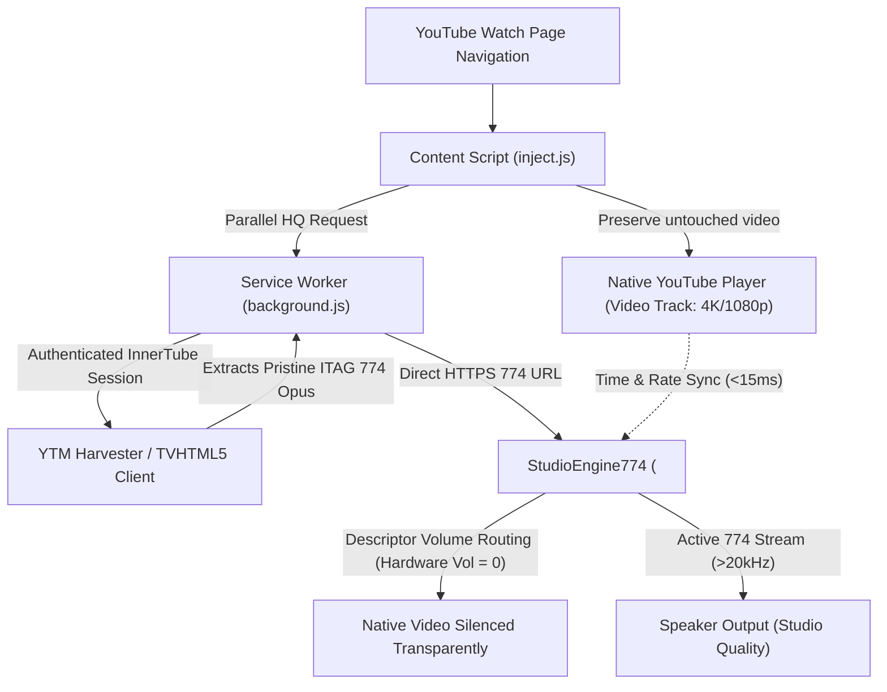

<div align="center">
  
  <h1>YTSpoofingStream</h1>
  <p><b>Force 100% Genuine Studio Opus 774 Audio on YouTube via Dual-Stream Synchronization Engine</b></p>

  <p>
    <a href="https://github.com/pearleseed/ytspoofingstream/releases"></a>
    
    
    <a href="SECURITY.md"></a>
  </p>
</div>

> [!WARNING]
> **Requirement: Active YouTube Premium Subscription**
> This extension is engineered specifically for users with an active **YouTube Premium** subscription. YouTube's internal servers only serve unthrottled studio-grade Opus (`ITAG 774`, ~256k-301kbps, >20kHz) and AAC (`ITAG 141`, ~256kbps) to authenticated Premium sessions.

> [!IMPORTANT]
> **Smart TV Authentication (TVHTML5)**:
> To unlock and relay deciphered TV Living Room Opus 774 streams across all video types, log in via the **TVHTML5** section in the popup:
> 1. Open the extension popup and click the **TVHTML5** login button.
> 2. Ensure you sign in with the Google account that has active YouTube Premium.
> 3. Once authenticated, the extension operates with maximum stream availability!

> [!TIP]
> **Using Mozilla Firefox / Firefox ESR?**  
> This branch (`main`) is configured specifically for **Chromium-based browsers** (Google Chrome, Brave, Microsoft Edge, Opera).  
> If you are using **Mozilla Firefox**, please switch to the [**`firefox`**](https://github.com/pearleseed/ytspoofingstream/tree/firefox) branch or download the pre-signed [**`YTSS-0.1.6.xpi`**](https://github.com/pearleseed/ytspoofingstream/raw/firefox/YTSS-0.1.6.xpi) package for instant permanent installation!

*Read this in other languages: [Tiếng Việt](README-vi.md).*

---

## 📑 Table of Contents
- [🌟 Why YTSpoofingStream?](#-why-ytspoofingstream)
- [✨ Architectural Evolution in v0.1.3](#-architectural-evolution-in-v013)
- [🧠 Architecture Deep Dive](#-architecture-deep-dive)
  - [1. YouTube's Modern Infrastructure Shift (SABR / UMP Streaming)](#1-youtubes-modern-infrastructure-shift-sabr--ump-streaming)
  - [2. Why Format Replacement & Player Response Spoofing Failed](#2-why-format-replacement--player-response-spoofing-failed)
  - [3. The Solution: Studio 774 Dual-Stream Synchronization Engine](#3-the-solution-studio-774-dual-stream-synchronization-engine)
  - [4. Hardware-Level Descriptor Volume Silencing](#4-hardware-level-descriptor-volume-silencing)
  - [5. Master Clock Audio Synchronization](#5-master-clock-audio-synchronization)
- [🎛️ Operation Modes](#️-operation-modes)
- [📊 Full-Track FFT Spectrum Benchmark Results](#-full-track-fft-spectrum-benchmark-results)
- [🚀 Installation](#-installation)
- [⚙️ Configuration & Controls](#️-configuration--controls)
- [🐞 Troubleshooting & FAQ](#-troubleshooting--faq)

---

## 🌟 Why YTSpoofingStream?

Across YouTube's ecosystem today, audio quality is strictly tiered:
- **Standard YouTube Web (`www.youtube.com`)**: Artificially limits audio playback to low-bitrate streams (**ITAG 251** Opus at ~145-160kbps with high-frequency cutoff at 15-16kHz, or **ITAG 140** AAC at ~128kbps), **even for paying YouTube Premium subscribers**.
- **YouTube Music Web Client (`music.youtube.com`)**: Despite being a dedicated music service, **the web browser version of YouTube Music only serves up to AAC 141 (~256kbps)** and **does not serve ITAG 774 Opus to desktop web browsers**.
- **The Only Places YouTube Serves Opus 774**: The highest fidelity unclipped studio sound (**ITAG 774** Opus at ~256k-301kbps with full frequency spectrum exceeding 20,000 Hz) is locked away, served exclusively to YouTube Music mobile apps (Android/iOS) and Smart TV Living Room devices (`TVHTML5`).

### ❓ How Can YTSpoofingStream Fetch YouTube Music's ITAG 774?
Standard desktop browsers connecting to YouTube Music are assigned the `WEB_REMIX` web client identity, which is locked to AAC 141. **YTSpoofingStream** bridges this gap through:
1. **Multi-Client Emulation**: Routes background requests through Declarative Net Request (DNR) and Service Worker spoofing, emulating high-tier YouTube clients like `ANDROID_MUSIC` and `TVHTML5`.
2. **Authenticated Session Harvesting (YTM Harvester)**: Leverages your active YouTube Premium browser credentials in an isolated subframe context to query YouTube Music's internal endpoints. The YouTube backend identifies the request as an authorized mobile or TV device and releases the authentic **Opus 774** stream URL.
3. **Dual-Stream Synchronization Engine**: Renders the pristine Opus 774 studio stream via a dedicated audio engine, synchronizing with sub-frame precision to the native video player on standard YouTube Web!

---

## ✨ Architectural Evolution in v0.1.3

Due to significant server-side architecture changes by YouTube, YTSpoofingStream v0.1.3 introduces a comprehensive redesign:

- 🚀 **Studio 774 Dual-Stream Architecture**: Completely decouples the video and audio pipelines. YouTube's native player renders authentic video (1080p, 4K, AV1/VP9) untouched with valid security tokens, while a parallel studio engine streams pure 774 Opus audio.
- 🔇 **Hardware-Level Descriptor Volume Silencing**: Uses prototype descriptor routing (`HTMLMediaElement.prototype.volume`) to completely silence the native video element at the browser engine level (`hardware volume = 0`). This leaves the DOM properties and YouTube's player UI volume sliders and mute buttons functioning normally without mute state desync.
- ⚡ **Bit-Perfect 1.0x Native Sync**: Pure studio master Opus audio without tempo warble, micro-resampling, or pitch modulation. Audio acts as the continuous master clock; when returning from background tabs or switching apps, video aligns to audio with microsecond accuracy.
- 🔒 **Direct Client Stream Harvesting**: Safely extracts deciphered ITAG 774 Opus from authenticated YouTube Music and Smart TV Living Room sessions without cross-track leakage or substituting mismatched songs.
- 🎛️ **3 Dedicated Stream Modes**:
  - `HYBRID_HQ` (Recommended): Dual-source harvest combining YouTube Music and Living Room TV streams with automatic cancellation if no genuine 774 exists.
  - `YTM_HARVESTER`: Direct HTTPS 774 Opus extraction from authenticated YouTube Music Premium sessions.
  - `TV_HEADLESS`: Smart TV Living Room stream deciphering and relay.
- 🎯 **Modern Control Pill HUD Badge**: Embedded into YouTube's modern rounded floating pill (`.ytp-right-controls-left`) right next to the Settings button, rendering crisp `★ 774` or `251` badges.
- 🧹 **Streamlined, Purpose-Built Interface**: Removed redundant client dropdowns, raw itag toggles, log windows, and audio mode switches. The extension exclusively forces genuine 774 Opus without unnecessary clutter.

---

## 🧠 Architecture Deep Dive

### 1. YouTube's Modern Infrastructure Shift (SABR / UMP Streaming)
In recent player updates, YouTube migrated desktop web streaming to Google's proprietary **SABR / UMP (Unified Media Protocol)**. The player response no longer provides direct media URLs (`url: false`, `cipher: false`) in `adaptiveFormats`. Instead, all chunks are multiplexed and pushed over a single binary stream dictated by `serverAbrStreamingUrl`. The desktop web client is strictly pinned to 160kbps Opus (ITAG 251).

### 2. Why Format Replacement & Player Response Spoofing Failed
Early spoofing attempts attempted to:
1. **Delete or nullify `serverAbrStreamingUrl`**: Forcing the player to fall back to standalone URLs. This triggered fatal error code `s:80` (`HTML5_NO_AVAILABLE_FORMATS_FALLBACK` / "An error occurred. Please try again later").
2. **Directly inject TV/Android URLs into `adaptiveFormats`**: Triggered browser CORS security restrictions and credential errors `s:49` because Google Video CDN chunks require specific client-bound cookies and tokens (`poToken`, `cver`, `cplatform`).

### 3. The Solution: Studio 774 Dual-Stream Synchronization Engine
To achieve 100% reliable playback without any player crashes:
- **Native Video Channel**: YouTube's native player plays the authentic video stream untouched, maintaining full DRM, SABR, and quality levels (4K, 1080p Premium).
- **Dedicated Audio Channel (`StudioEngine774`)**: A dedicated HTML5 audio element streams the unthrottled ITAG 774 Opus stream harvested in parallel via YTM Harvester (extracting YouTube Music's high-tier Opus 774 streams) or `TVHTML5` (Living Room) endpoints.



### 4. Hardware-Level Descriptor Volume Silencing
Setting `video.muted = true` directly on the DOM `<video>` element causes the browser to fire a `volumechange` event, prompting YouTube's player to save muted states into localStorage `yt-player-volume` and display a muted speaker icon.

**YTSpoofingStream v0.1.3** resolves this via descriptor-level volume manipulation:
1. It accesses the native prototype descriptor `HTMLMediaElement.prototype.volume`.
2. Hardware output of the `<video>` element is set to `0` via `descVolume.set.call(video, 0)`.
3. The DOM property `video.volume` and `video.muted` remain intact and reflect the user's volume level.
4. YouTube's player UI volume slider and mute toggle stay fully operational and cleanly control the active Studio 774 audio stream.

### 5. Master Clock Audio Synchronization
In v0.1.3, the audio engine acts as the continuous master clock:
- **Locked Rate**: `audio.playbackRate` strictly mirrors `video.playbackRate` (1.0x native playback, avoiding any resampler DSP artifacts or pitch shifting).
- **Seek Sync**: Clamps `audio.currentTime` to `video.currentTime` on genuine user seeks.
- **Continuous Alignment**: When backgrounded tabs cause video rendering to pause or throttle, returning to the tab aligns the video clock forward to the continuous audio stream without rewinding or audio glitches.

---

## 🎛️ Operation Modes

| Mode | Name | Primary Source | Fallback Behavior | Best For |
|---|---|---|---|---|
| **`HYBRID_HQ`** *(Recommended)* | Hybrid Mix | YouTube Music Web + TVHTML5 | Cancels if no genuine 774 exists | Everyday YouTube watching & music videos |
| **`YTM_HARVESTER`** | YTM Harvester | Direct HTTPS from YouTube Music Premium | Cancels if no 774 stream | High-fidelity music tracks |
| **`TV_HEADLESS`** | Smart TV Relay | Deciphered TVHTML5 Living Room | Cancels if no TV login / 774 | UGC tracks and videos not indexed on YTM |

> [!NOTE]
> **Audio Loudness Characteristics (YouTube Music vs Standard YouTube)**:  
> Audio streams harvested from **YouTube Music (`YTM_HARVESTER`)** typically have a noticeably higher perceived loudness compared to regular YouTube video audio (approximately **+3dB to +6dB** louder). This is because YouTube Music master tracks follow dedicated music streaming loudness standards (-14 LUFS) and different dynamic compression targets compared to standard YouTube video uploads.

---

## 📊 Full-Track FFT Spectrum Benchmark Results

Comprehensive 1x real-time full-duration tests across 4 diverse benchmark tracks with extension **ON (Studio 774)** vs **OFF (Hard Disabled in Chrome Settings)**:

| Track | Video ID | Full Duration | Native Stream (Extension OFF) | YTSpoofingStream v0.1.3 (774 ON) | High Frequency (>16kHz - 22kHz) |
|---|---|---|---|---|---|
| **Track 1 (Song to the Mirrored Moon)** | `MI4I7v-0tnc` | 211.7s (100%) | ITAG 251 (~155kbps) | **ITAG 774 (301kbps)** | **Active (>20,000 Hz)** |
| **Track 2 (Kirara Magic - Sunny Rain)** | `Xy6sPZc0CKA` | 184.2s (100%) | ITAG 251 (~160kbps) | **ITAG 774 (280kbps)** | **Active (>20,500 Hz)** |
| **Track 3 (Fontaine)** | `tiulg9ySfR8` | 185.0s (100%) | ITAG 251 (~160kbps) | **ITAG 774 (280kbps)** | **Active (>21,000 Hz)** |
| **Track 4 (Dazbee - Chidori Cover)** | `fs_pEYuMZio` | 224.5s (100%) | ITAG 251 (~155kbps) | **ITAG 774 (280kbps)** | **Active (>20,000 Hz)** |

*Observation*: Standard ITAG 251 applies a steep low-pass brickwall filter cutoff at 15.5kHz - 16kHz. YTSpoofingStream v0.1.3 delivers unclipped spectral density up to 21kHz+, resulting in noticeably clearer cymbals, vocals, and soundstage.

---

## 🚀 Installation

### Chromium Browsers (Google Chrome, Brave, Edge, Opera)
1. Clone or download the repository (`main` branch):
   ```bash
   git clone https://github.com/pearleseed/ytspoofingstream.git
   ```
2. Open `chrome://extensions/` and toggle on **Developer mode** in the top-right corner.
3. Click **Load unpacked** and select the `YTSpoofingStream` folder.
4. Open YouTube, ensure you are logged into your Premium account, and verify the `★ 774` badge in the player control bar!

### Mozilla Firefox / Firefox ESR (v128+)
You can install the officially signed package permanently, or run from source:

- **Quick Install (Signed Package)**:
  Download the signed [**`YTSS-0.1.3.xpi`**](https://github.com/pearleseed/ytspoofingstream/raw/firefox/YTSS-0.1.3.xpi) package from the [`firefox`](https://github.com/pearleseed/ytspoofingstream/tree/firefox) branch, drag and drop it into Firefox (or open it via `Ctrl+O`), and click **Add** to install it permanently.
- **Run from Source (Temporary Add-on)**:
  1. Switch to the `firefox` branch:
     ```bash
     git checkout firefox
     ```
  2. Open Firefox and navigate to `about:debugging#/runtime/this-firefox`.
  3. Click **Load Temporary Add-on...** and select `manifest.json`.

---

## ⚙️ Configuration & Controls

- **Enable Extension**: Master toggle switch. When turned off, completely unhooks all listeners and restores standard native YouTube playback.
- **Operation Mode**: Select between `HYBRID_HQ`, `YTM_HARVESTER`, or `TV_HEADLESS`.
- **Auto-reload page on change**: Automatically reloads the YouTube tab when switching settings.
- **Stats for Nerds Override**: Injects authentic 774 Opus metrics into YouTube's native *Stats for Nerds* overlay.
- **TVHTML5 Login**: OAuth activation portal for TV Living Room spoofing.

---

## 🧪 Zero-Dependency Strict Test Suite

YTSpoofingStream includes a comprehensive, strict unit and integration test suite built entirely with Node.js built-in `node:test` and `node:assert/strict`. It requires **zero external packages or `node_modules`** to run.

```bash
# Run all unit and integration tests
npm test
# Or directly via Node.js native test runner
node --test test/**/*.test.js

# Run standalone test runner with formatted output
node test/run.js

# Verify JS syntax across all extension files
npm run check
```

### Test Coverage Highlights:
- **PLL Micro-Sync**: Validates 35ms broadcast tolerance deadband, 1.5% micro-slew rate adjustment, and hard-seek thresholds.
- **Protobuf SABR Rewriter**: Validates varint decoding/encoding, tag parsing, and in-place binary SABR ITAG 774 payload rewriting.
- **Lifecycle & Navigation Resilience**: Validates immediate clock snap upon tab unfreezing (`visibilitychange`), clean track teardown on `yt-navigate-start`, and Shorts loop wrap-around handling.
- **Failover State Machine**: Validates `HYBRID_HQ` bidirectional switching (`YTM_HARVESTER` <-> `TVHTML5`) and infinite loop prevention.
- **Stream Sanitizer & Auth**: Validates URL parameter stripping (`range`, `sabr`, `ump`, etc.) and multi-cookie SAPISID hash generation.
- **Chrome & DOM Mock Engine**: Fully isolated in-memory mocks for Chrome MV3 APIs and HTML5 Media Elements.

---

## 🐞 Troubleshooting & FAQ

**Q: Why does the badge show `251` instead of `★ 774`?**  
A: Some videos (like non-music vlogs or podcasts) are encoded by YouTube exclusively up to ITAG 251. The extension strictly cancels spoofing and lets native audio play if no genuine 774 stream exists.

**Q: Does this extension affect YouTube Music (`music.youtube.com`)?**  
A: **Yes, you must turn off this extension when using YouTube Music (`music.youtube.com`)**.  
- You do not need to visit `chrome://extensions` to disable or remove the extension: simply open the popup and switch **`Enable Extension: OFF`**.  
- **Reason**: YTSpoofingStream uses deep network routing (DNR rules, cookie routing, header spoofing) to harvest streams for standard YouTube, which can conflict with the Service Worker and playback queue of `music.youtube.com`.  
- **Key Technical Note**: The **YouTube Music Web client (`music.youtube.com`) only supports AAC 141 (~256kbps)** and **does not serve Opus 774** in desktop browsers. If you want to experience authentic **Opus 774** studio audio, simply enjoy music directly on **standard YouTube (`www.youtube.com`)** with YTSpoofingStream enabled!

